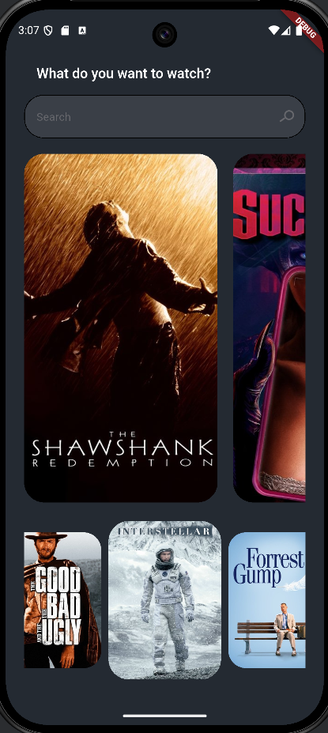

# Movies App 🎬

**Movies App** is a modern Flutter application that lets users browse and discover top-rated movies using the **TMDb API**. The app features a clean, responsive UI with **ListView** and **CarouselSlider** to showcase movie posters and details.

---

## Features ✨

- Browse top-rated movies with posters and details.
- Horizontal scrollable **ListView** of movies.
- **CarouselSlider** for featured movies.
- Search bar UI for movie search (UI ready).
- Clean and modern Flutter design.

---

## Screenshots 📱



---

## Installation ⚙️

1. Clone the repository:
```bash
git clone https://github.com/MohamedMahmoudLashin/movies_app.git
